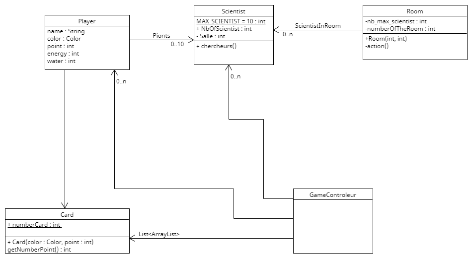

# Hyperstellar Happy Corporate Science Space Station

Jeu de plateau de stratégie en C# réalisé pour mon IUT uniquement fait en C# avec .NET Windows Form

## Sommaire 

<!--faire un sommaire avec des liens cliquables vers les sujets-->
[Présentation du projet](#présentation-du-projet) 
[Présentation du jeu](#présentation-du-jeu) 
[Règles du jeu](#règles-du-jeu) 

## Présentation du projet

Ce projet est un jeu de plateau réalisé pour l'IUT, les règles du jeu nous avont été donné, nous devions alors réaliser le jeu en C# avec .NET Windows Form.

Nous avions 1 mois pour le faire, nous étions 4 sur le projet.

## Présentation du jeu

Hyperstellar Happy Corporate Science Space Station est un jeu de plateau dans lequel chaque joueur est un milliardaire visionnaire et novateur, qui a délaissé la vie terrestre pour se consacrer à l’exploration spatiale au sein d’une station spatiale de recherche scientifique privée pour l’avancée générale du genre humain.   Cette mission nécessite des capitaux immenses, et donc la collaboration de plusieurs milliardaires partageant la même aspiration.  Mais chacun souhaite être le plus grand scientifique
visionnaire novateur et devenir le maître incontesté de la station, et donc à terme de l’univers entier... 

## Règles du jeu

<!--Faire un tableau en md-->
| Séquence | Que se passe-t-il |
| :---: | :---: |
| Partie | Une partie de jeu, se terminant à la fin de la révolution dans laquelle un joueur gagne. |
| Révolution | Une séquence comportant une phase de placement complète,  une phase d’action complète,   une phase d’entretien complète.   À la fin d’une révolution, une autre commence, sauf si la partie est terminée |
| Phase de placement | Une phase dans laquelle se déroulent autant de rotations de placement que nécessaire pour placer les pions de chaque joueur. Après cette phase, une phase d’action est lancée |
| Rotation de placement | Une rotation est un tour de table dans l’ordre des joueurs : chaque joueur place un pion, chacun à son tour. Les rotations de placement s’enchaînent jusqu’à ce qu’il n’y ait plus de pions à placer. |
| Phase d’action | Une phase dans laquelle se déroulent autant de rotations d’action que nécessaire pour que chaque joueur ait joué. Après cette phase, une phase d’entretien est lancée |
| Rotation d’action | Une rotation d’action concerne un secteur, chaque joueur qui dispose de pions dans le secteur les retire et les replace sur le moyeu de la station en accomplissant l’action du secteur, dans l’ordre des joueurs. Quand cette rotation est terminée, on passe à celle du secteur suivant. |
| Action | Accomplir une action pour un joueur, pour un secteur, et replacer les pions sur le moyeu central avant de passer à l’action suivante. |
| Phase d’entretien | Chaque joueur paie l’entretien de ses pions. S’il ne peut plus payer cet entretien, il perd un pion (et un seul). S’il n’a plus de pion, il perd la partie. L’entretien et ses conséquences sont gérés en une seule fois pour chaque joueur dans l’ordre des joueurs. La fin de cette phase met fin à la révolution en cours |
 
### Début de partie :

Deux à quatre joueurs prennent place.  Chaque joueur s’assied autour de la table, ils jouent dans l’ordre de leur placement (joueur en haut, puis à droite, puis en bas, puis à gauche).  Chaque joueur reçoit 10 *jetons énergie* et 10 *jetons eau* qu’ils placent devant eux, dans leur stock personnel (visible par tous en permanence).  Deux *pions chercheur* de la couleur de chaque joueur sont placés au centre du plateau (sur le moyeu de la station), les huit autres sont remis dans le stock du jeu. Les *cartes science* sont mélangées et posées en une pile.
 
### Déroulement d’une révolution - phase de placement :

Les joueurs jouent chacun à leur tour, du premier au dernier dans une **rotation de placement** (tour de table).  Chaque joueur prend un **pion** (chercheur) de **sa couleur** du centre du plateau (le moyeu) pour le poser dans un emplacement d’action **libre** de son choix avant que le joueur suivant fasse de même.  Si un des joueurs ne dispose plus de pions au centre du plateau et que la phase de
placement continue, il récupère **un** *jeton énergie* au lieu de placer un pion.  Une nouvelle rotation de placement est lancée s’il des pions peuvent au centre du plateau.  La phase de placement s’interrompt immédiatement s’il n’y a plus d’emplacements d’action libres, les pions non placés restent au centre du plateau

### Déroulé d’une révolution – phase d’action :

Quand les joueurs ont fini leurs placements, les actions sont accomplies. Chaque joueur reprend ses pions posés sur des emplacements d’actions pour effectuer **au plus une fois par joueur et par secteur** l’action du secteur correspondant, suivant les règles qui suivent.  Il est possible de poser plus de pions pour *bloquer* un secteur, mais pas pour bénéficier de ses effets deux fois dans un même tour.  Les actions sont résolues dans l’ordre des secteurs (1, 2, 3, 4) ; pour chaque secteur, on effectue une **rotation d’action**, c’est-à-dire que les actions de chaque secteur sont accomplies dans l’ordre des joueurs. L’ordre des secteurs est le suivant :
1. Les joueurs qui ont un pion sur un emplacement d’action de la salle des machines récupèrent
sept jetons énergie.
2. Les joueurs qui ont un pion sur un emplacement d’action du laboratoire de recherche peuvent
faire chacun l’une des deux actions suivantes : 
- (a) Dépenser deux jetons énergie pour faire de la recherche, en piochant les deux premières cartes science de la pile. Si un joueur doit piocher des cartes et qu’il n’en reste plus assez, la défausse est mélangée et devient la nouvelle pile de cartes. 
- (b) Dépenser deux jetons énergie par carte à valoriser pour valoriser leur recherche, suivant les cartes science qu’ils ont en main, pour les combinaisons suivantes – autant que souhaité : 
- - i. Sept cartes de couleurs différentes permettent de marquer 50 points, 
- - ii. Six cartes de couleurs différentes permettent de marquer 30 points, 
- - iii. Quatre cartes de couleurs différentes permettent de marquer 10 points, 
- - iv. Cinq cartes de couleur identique permettent de marquer 7 points, 
- - v. Une carte de la couleur du joueur permet de marquer 3 points. 
- - Dans chacune de ces situations, les cartes science sont défaussées, et le joueur avance son marqueur du nombre de points correspondant sur la fresque des points de victoire. 
3. Les joueurs qui ont un pion sur un emplacement d’action du centre de recyclage peuvent effectuer une seule de ces deux actions :
- (a) dépenser deux jetons énergie et récupérer quatre jetons eau; quand cette action est accomplie, chaque autre joueur peut choisir de dépenser un jeton énergie pour récupérer un jeton eau, ou (exclusif) 
- (b) dépenser cinq jetons énergie et récupérer sept jetons eau; quand cette action est accomplie, chaque autre joueur pioche lui-même un jeton eau. 
4. Les joueurs qui ont deux pions sur un emplacement d’action des quartiers d’équipage peuvent dépenser cinq jetons énergie pour récupérer un pion chercheur supplémentaire (les trois pions sont replacés au centre du plateau). Chaque joueur est limité à dix pions chercheur en tout. Chacun des pions qui était sur un emplacement d’action d’un secteur revient sur le centre du plateau dès l’action accomplie.

### Fin d’une révolution – phase d’entretien :

Ensuite, chaque joueur **paie l’entretien de ses chercheurs**, en dépensant un jeton eau par pion (quel que soit la position de ce pion).  Tous les pions du joueur sont concernés.  S’il ne reste plus d’eau, le joueur perd un pion.  Un joueur qui perd tous ses pions a perdu la partie lors de cette phase, à son tour, sauf s’il s’agit du dernier joueur en jeu.  S’il ne reste plus qu’un joueur, il a gagné à la fin de la phase (et de la révolution).   La révolution suivante est lancée, sauf si la partie est terminée.

### Fin de partie :

La partie est terminée quand un joueur atteint ou dépasse 150 points de victoire (tour complet sur la frise) : ce joueur a gagné, et le classement des joueurs suivant se lit sur la frise des points de victoire.   Elle est également terminée s’il ne reste plus qu’un joueur à la fin d’une révolution.

## Structure du code 

Le code est fait en C# avec le frameworks de .NET Windows Forms.   Le language du code est fait en anglais, mais il n'as qu'une seule langue pour jouer au jeu : français. 

Le projet est fait uniquement avec le framework de .NET Windows Forms, ça rend le code complexe pour pas grand choses.  L'affichage du jeu à été calculé pour bien coller sur les écrans de notre école, donc sur d'autre résolution d'écran ça peut être décalé.  Il est possible de changer cela mais certains éléments du jeu sont positionner différement que certains d'autres, donc il faudrait tout repositionner.  (ca reste un projet étudiant en première année, donc il y a des erreurs et des choses à améliorer, mais le jeu reste jouable et fonctionnel)

## Structure du code (initiale, ne correspond plus au code actuel)

## Overall :

Le jeu est fonctionnelle mais vraiment pas terminé et pas si complet que ça. 
Le code est pas très propre et pas très bien structuré, mais il fonctionne. 

Certains visuels sont pas très beau, mais ça reste un projet étudiant. 

Les visuelles ne nous appartiennent pas, ils sont tous pris sur internet + quelqu'uns sont modifiés. 

Faites ce que vous voulez du code, vous ne pouvez pas le vendre avec le visuel actuel du jeu, mais vous pouvez le modifier et le vendre avec vos propres visuels. 

Si vous voulez modifier des choses, il faudra refactor du code (c'est parfois mal codé). 

Overall ça été un bon projet, je me suis éclaté à le faire, et j'espère que vous vous éclaterez à le jouer.(si vous pouvez y joue) 